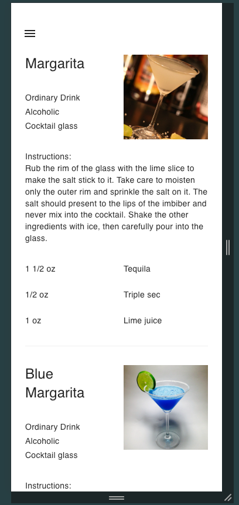

# Тестовое задание для компании МАКСИБИТСОЛЮШЕН

## Задача
Реализовать несколько страниц с информацией о коктейлях. Необходимо реализовать адаптивную верстку и масштабируемую
архитектуру, чтобы код можно было без проблем расширять и модифицировать.

## Реализация
### Краткое описание кода
В корне проекта находятся только конфиги и билд. Основной код приложения сложен в директорию src.
Внутри лежит несколько директорий:  
components - основные UI компоненты. Глупые, умеют только рисовать в нужных местах, на нужных адаптивах  
consts - константы, которые потребовались мне для разработки. Всего их 2, но сложил в разные файлы, т.к. по смыслу они 
различаются  
pages - 2 страницы: основная с коктейлями и 404  
plugins - плагины, там подключаются pinia и vuetify  
router - собственно роутер с простенькой миддлварой: динамический маршрут для определения знаем ли мы текущую страницу 
или надо показывать 404. Также там лежит условие, что при одиноком / в урле - перенаправляем на первый коктейль в списке  
services - сервис и pinia store. Сервис спроектирован так, чтобы минимально использовать какие-то привязки к Vue.
Это позволяет нам с минимальными изменениями забрать его на любой другой стек (единственное необходимое изменение - 
переменная стора).  
Стор же сделан таким образом, чтобы хранить информацию обо всех коктейлях о которых мы знаем. 
Для минимальной реализации тестового задания сделал чуть упрощенный вариант и список известных коктейлей тащится из 
енама. Но это довольно просто можно переквалифицировать в справочник, который может запрашиваться с сервера.
В общем динамический стор, который позволяет спокойно расширять список коктейлей, просто пополняя соответствующий енам.  
types - типы, использованные в приложении. Тип-замена ДТО коктейля сделан больше для удобства, чтобы TS знал, какие 
свойства есть в объекте, с которым мы работаем.  

В .env достаточно просто сложить `VITE_API_URL='https://www.thecocktaildb.com/api/json/v1/1/'`  

### Немного картинок
Ниже 2 скриншота: как все выглядит на большом экране и на мелком:

